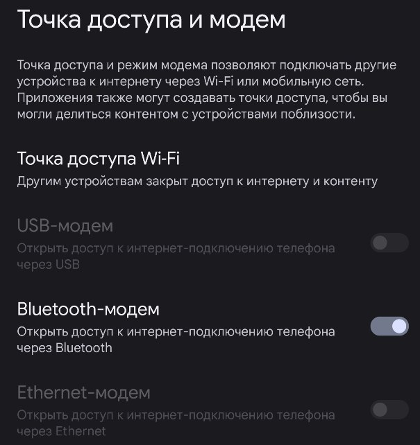

# Bluetooth

Если ты шел по порядку то ты уже правил config.toml и знаешь как получить доступ к нему через ssh.

Первым делом исправим блок кода в config.toml отвечающий за плагин bt-tether

`main.plugins.bt-tether.enabled = true #Включение плагина`\
\
`main.plugins.bt-tether.devices.android-phone.enabled = false #Подключание к Android`\
`main.plugins.bt-tether.devices.android-phone.search_order = 1`\
`main.plugins.bt-tether.devices.android-phone.mac = "" #MAC адрес Bluetooth телефона (в верхнем регистре)`\
`main.plugins.bt-tether.devices.android-phone.ip = "192.168.44.44" #Адресс для подключения к веб интерфейсу`\
`main.plugins.bt-tether.devices.android-phone.netmask = 24`\
`main.plugins.bt-tether.devices.android-phone.interval = 1`\
`main.plugins.bt-tether.devices.android-phone.scantime = 60 #Время сканирования для поиска устройств`\
`main.plugins.bt-tether.devices.android-phone.max_tries = 60 #Кол-во попыток подключений после потери соединения`\
`main.plugins.bt-tether.devices.android-phone.share_internet = true #Раздача интернета через Bluetooth`\
`main.plugins.bt-tether.devices.android-phone.priority = 1 #Приоритетподключения (1 = наивысший приоритет)`

Очень много проблем возникает с подключением к pwnagotchi обычно из-за невнимательности пользователя и игнорирования основныx правил:

* Изменения в config.toml необходимо проводить в режиме manu!
* Включение на телефоне Bluetooth модема (Фото: 1).
* Во время первого подключения к pwnagotchi находиться на экране поиска других устройств (Фото: 2).

<figure><figcaption></figcaption></figure>

<figure><figcaption></figcaption></figure>

После проделанных операций и сохраненного config.toml можете перезапустить pwnagotchi в режим auto.

После перезапуска pwnagotchi ожидайте хотя бы 5 минут уведомления на телефоне от pwnagotchi о новом соединении.

В случае если спустя 5 минут уведомление не появилось, обратите внимание на статус `BT` в верхней части экрана pwnagotchi.

* **C -** Подключено, это означает, что соединение с устройством установлено.
* **NF -** Not found, Это означает, что не удалось установить соединение с устройством (вероятно, потому что оно не было найдено).
* **PE -** Ошибка сопряжения, эта ошибка возникает при возникновении проблемы сопряжения.
* **BE** - Bnep, эта ошибка возникает, когда не удается создать NAP.
* **AE** - Ошибка адреса, IP-адрес не может быть назначен интерфейсу NAP.

