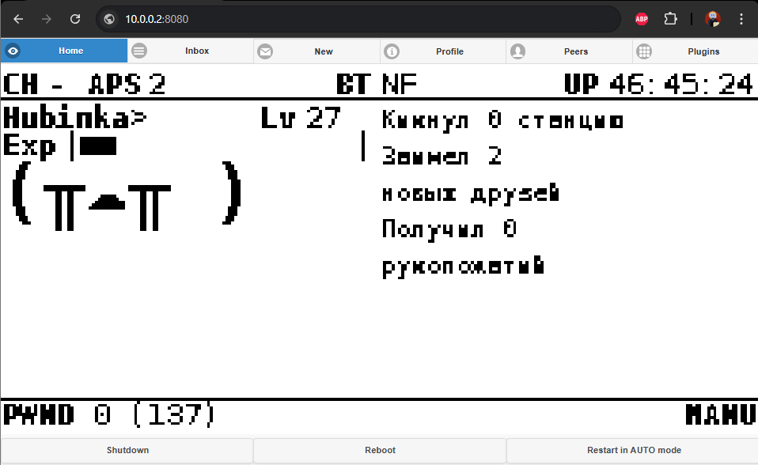

# SSH

Немного забегая вперед скажу:\
После настройки ip адреса для RDNS устройства первым делом рекомендую зайти на WEB UI (Веб интерфейс) Pwnagotchi чтобы убедиться что все работает нормально.\
Для этого в строке браузера (не в поисковике) наберите:

&#x20;[`10.0.0.2:8080`](http://10.0.0.2:8080/)  IPpwnagotchi:PORT из config.toml (по умолчанию: 8080)

Это вам позволит наблюдать за лицом Pwnagotchi и даст доступ к дополнительным вкладкам.

<figure><figcaption>
Пример автора, у вас будет почти так же.
</figcaption></figure>

## Подключение по SSH:

Есть множество клиентов SSH с помощью которых вы можете получить доступ к Pwnagotchi.\
В этом пункте будем использовать "Командную строку" или "PowerShell" так как они уже предустановлены в Windows.

&#x20;В нашем случае никакой разницы нет (почти). Так что я буду использовать для примера "PowerShell":

<figure><figcaption>
Окно "PowerShell"
</figcaption></figure>

Советую изучить SSH и команды Unix и Linux систем, это пригодится в будущем.

Для того чтобы подключиться с помощью программы SSH (да, ssh это программа).\
Вы должны указать базовые параметры для подключения к pwnagotchi, такие как имя пользователя к которому мы подключаемся и ip адрес, разделив это все: "@".

В нашем случае команда будет выглядеть так:

`ssh pi@10.0.0.2`

<figure><figcaption>
В случае автора ip адрес будет отличаться.
</figcaption></figure>

При первом подключении нужно будет создать пару ключей SSH.\
Просто вводим "`yes`".

<figure><figcaption></figcaption></figure>

Пароль по умолчанию: `raspberry`\
Учтите что пароль не будет отображаться, это нормально. но если вы ввели ошибку вы можете стереть весь пароль зажав [Backspace](https://ru.wikipedia.org/wiki/Backspace).

<figure><figcaption>
Приветственное сообщение Pwnagotchi
</figcaption></figure>

Поздравляем, вы только что подключились к Pwnagotchi через SSH.\
Дальше будет работать только четкое понимание вводимых команд и они самые.

Обратите внимание на приветственное сообщение:

В нем рассказано самое основное что вам нужно знать о Pwnagothi и полезные команды, разберем их:

Главный конфигурационный файл лежит здесь:  `/etc/pwnagotchi/config.toml`

Все параметры/строчки которые можно добавить в `config.tom`  лежат в `/etc/pwnagotchi/default.toml`

Для просмотра логов используйте:\
`tail -f /var/log/pwnagotchi.log`

Для просмотра статуса Pwnagotchi используйте:\
`systemctl status pwnagotchi`

Чтобы перезапустить Pwnagotchi как сервис (Чтобы не перезапускать физически Raspberry):\
`systemctl restart pwnagotchi`

Для перехода в автоматический режим:\
`touch /root/.pwnagotchi-auto && systemctl restart pwnagotchi`

При подключении Pwnagotchi по USB учтите что pwnagotchi будет всегда в `MANU`.

