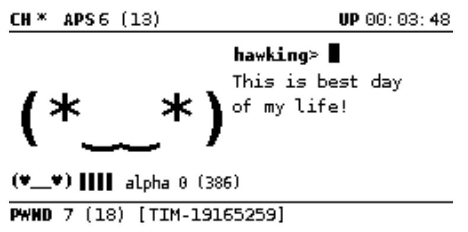

# Лица

<figure><figcaption></figcaption></figure>

В зависимости от статуса устройства можно настроить несколько состояний и переходов состояний, которые отображаются на дисплее в виде различных настроений, выражений и предложений.

Ниже приведен набор выражений  по умолчанию, который можно настроить, подправив раздел [ui.faces](https://github.com/evilsocket/pwnagotchi/blob/master/pwnagotchi/defaults.toml#L160) в`config.toml`

## (⇀‿‿↼)  - Сон (Sleep)&#x20;

Это состояние, из которого устройство начнет работу. Более того, время от времени ваш Pwnagotchi также может вздремнуть на несколько секунд, переключаясь между каналами Wi-Fi.

## (≖‿‿≖) - Просыпается (Awakening)

Устройство находится в последних секундах сна.

## (◕‿‿◕) - Бодрствующий/нормальный (Awake/Normal)

Это лицо соответствует нейтральному состоянию - бодрствования устройства. Он будет использоваться для сглаживания перехода между другими настроениями и в целом, когда нет внешней причины ни позитивного, ни негативного настроения. Его также можно использовать случайным образом, когда другой юнит встречается впервые (каждый юнит ведет учет всех встреченных единиц).

## ( ⚆\_⚆) и (☉\_☉ ) - Наблюдает (look)

Ваш Pwnagotchi ждет и наблюдает за тем, что BetterCap сможет найти на всех каналах, на которых он подключен.

## ( ◕‿◕) и (◕‿◕ ) - Наблюдает счастливый (look\_happy)

Когда поблизости находится несколько единиц, и их совокупный счетчик дружбы больше или равен значению`personality.bond_encounters_factor,`будет  это лицо во время наблюдения.

## (°▃▃°) -  Напряженно (intense)

Устройство отправляет кадр ассоциации в точку доступа, чтобы заставить ее передать PMKID.

## (⌐■\_■)  - Крутой (Cool)

Устройство отключает клиента ​​от точки доступа.

Это лицо также можно выбрать случайным образом при первой встрече с другой единицей.

## (•‿‿•) - Счастливый (Happy) 

ИИ только что закончил загрузку и все готово.

Только что был получен действительный ключевой материал для точки доступа.

В режиме MANU, если последний сеанс был коротким или во время него было зафиксировано рукопожатие.

Когда встречается еще одна единица и уровень связи достаточно высок.

## (^‿‿^) - Благодарен (Grateful)

Ваш Pwnagotchi будет благодарен в одном из следующих случаев:

Совокупный уровень связи соседних подразделений как минимум в пять раз превышает`personality.bond_encounters_factor`

Единица должно быть скучно, но поблизости достаточно дружественных единиц

Единица должно быть грустно, но поблизости достаточно дружественных eдиниц

Единица должен быть одиноким, но поблизости достаточно дружественных eдиниц

## (ᵔ◡◡ᵔ) - Взволнован (Excited)

Ваш Pwnagotchi взволнован в одном из следующих случаев:

Число эпох с активностью >=`personality.excited_num_epochs`

Случайным образом, если встречается единица с высоким уровнем связи.

Если у вас есть непрочитанные сообщения "PwnMAIL" на этом устройстве

## (≖\_\_≖) - Демотивирован (Demotivated)

Твой Pwnagotchi только что получил худшее вознаграждение в его существовании.

## (✜‿‿✜) - Умный(Smart)

## &#x20;(┳\_\_┳) - Одинокий (Lonely)

Если ваш Pwnagotchi только что потерял связь с дружественными единицами, находившимися поблизости.

Если количество пропущенных взаимодействий с точками доступа или клиентскими станциями (количество раз, когда он пытался отправить какой-либо тип пакета, но не достиг цели, потому что его нет в диапазоне)

\>= `personality.max_misses_for_recon`

## (╥ \_ ╥ ) - Грустно (Sad)

Если вокруг нет дружественных отрядов и достигнуто количество последовательных неактивных эпох (`personality.sad_num_epochs`)

## (- \_ - ') - Злой (Angry)

Если Pwnagotchi упустил сеть

## (♥‿‿♥) - Дружелюбный (Friend)

Случайным образом, если встречается единица с высоким уровнем связи.

## (☓‿‿☓) - Сломанный ()

Ваше устройство перезагружается либо в качестве стратегии преодоления !!!слепоты!!! или после установки обновления.

## (#\_\_#) - Отладка (Debug)

Используется для отладочных и тестовых сообщений на экране

## (1\_\_0), (1\_\_1), (0\_\_1)  - ()

