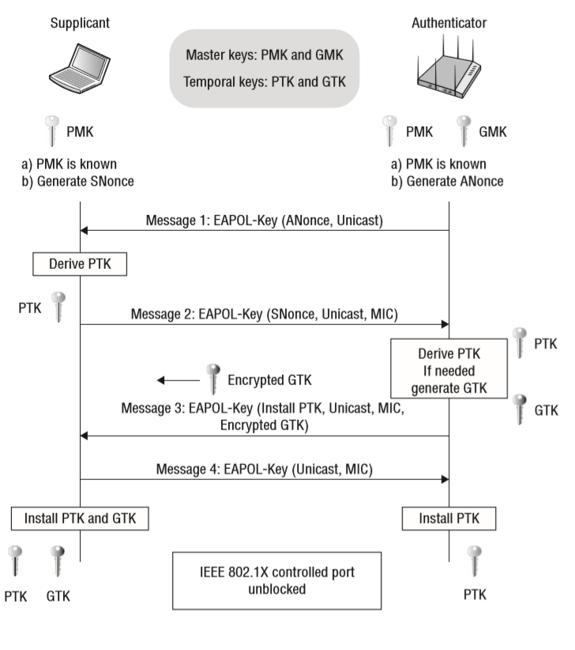

# Рукопожатия Wi-Fi 101

Чтобы понять, почему так важно иметь ИИ, который хочет ловить рукопожатия, полезно немного понять, как рукопожатия используются в беспроводном протоколе WPA/WPA2.

Прежде чем клиентское устройство, подключающееся к беспроводной точке доступа (скажем, ваш телефон, подключенный к домашней сети Wi-Fi), сможет безопасно передавать и получать данные от этой точки доступа, необходимо выполнить процесс, называемый **четырехэтапным рукопожатием.** Чтобы были сгенерированы ключи шифрования WPA. Этот процесс состоит из обмена четырьмя пакетами (отсюда и “4” in “4-Way”) между клиентским устройством и точкой доступа; они используются для получения сеансовых ключей из пароля Wi-Fi точки доступа. После успешного обмена пакетами и генерации ключей клиентское устройство аутентифицируется и может начать отправлять и получать пакеты данных (теперь защищенные шифрованием) на беспроводную точку доступа и обратно.

<figure><figcaption>
<a href="https://www.wifi-professionals.com/2019/01/4-way-handshake">https://www.wifi-professionals.com/2019/01/4-way-handshake</a>
</figcaption></figure>

Итак… в чем подвох?

Что ж, эти четыре пакета могут легко «пронюхать» злоумышленнику, наблюдающему поблизости (скажем, с помощью Pwnagotchi 😇). И после записи злоумышленник может использовать [атаки по словарю и/или методом перебора](https://hashcat.net/wiki/doku.php?id=cracking\_wpawpa2) взломать рукопожатия и восстановить исходный ключ WiFi. На самом деле, **для успешного восстановления ключа WiFi не обязательно нужны все четыре пакета!**&#x20;

Полурукопожатие (содержащее только два из четырех пакетов) тоже можно взломать — и в некоторых _(большинстве)_ случаев [одного пакета достаточно](https://hashcat.net/forum/thread-7717-post-41447.html), _даже без клиентов._

Для того, чтобы собрать как можно больше таких взломанных пакетов рукопожатия, Пвнагочи использует две стратегии:[\
](https://i.imgur.com/nI8IE6a.png)

1. **Деаутентификация обнаруженных клиентских станций.** Устройство, не прошедшее аутентификацию, должно повторно аутентифицироваться на своей точке доступа, повторно выполнив четырехстороннее рукопожатие с точкой доступа, тем самым давая Pwnagotchi еще один шанс прослушать пакеты подтверждения и собрать больше взломанного материала.
2. **Отправка ассоциативных фреймов непосредственно самим точкам доступа,** чтобы попытаться заставить их выдать[ PMKID](https://www.evilsocket.net/2019/02/13/Pwning-WiFi-networks-with-bettercap-and-the-PMKID-client-less-attack/).

## Пассивный сбор

В дополнение к двум вышеперечисленным методам **существует третий метод, с помощью которого Пвнагочи полностью пассивно собирает рукопожатия:** если устройство пытается аутентифицироваться на точке доступа на том же канале, который устройство в это время отслеживает, Pwnagotchi может ~~собирать~~ рукопожатия совершенно случайно (а **не** в результате деаутентификации или атаки PMKID).\
\
Например, даже если вы внесете свою домашнюю сеть в белый список, чтобы Pwnagotchi знал, что никогда не следует активно атаковать ее, вы **все равно будете** _случайно_ пассивно собирать рукопожатия для этой сети, поскольку ваш Pwnagotchi просто перехватывает пакеты в своей среде. (Если вы наблюдаете за жилым районом, вы можете заметить рост числа пассивно полученных рукопожатий, когда ваши соседи включают свои устройства утром и снова ранним вечером, когда они возвращаются домой после работы.)

Все рукопожатия, зафиксированные вашим Pwnagotchi, сохраняются в `.pcap`файлах его файловой системы. Каждый файл PCAP, создаваемый Pwnagotchi, организован в соответствии с точкой доступа; один PCAP будет содержать все рукопожатия, которые Пвнагочи когда-либо перехватывал для этой конкретной точки доступа.
